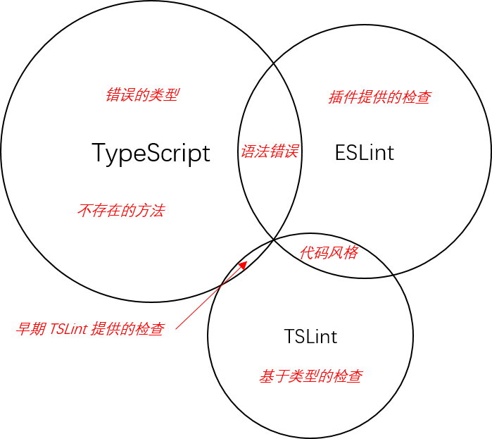
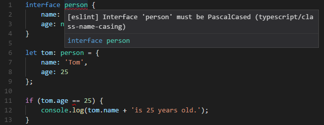

# 程式碼檢查

目前 TypeScript 的程式碼檢查主要有兩個方案：使用 [TSLint](https://palantir.github.io/tslint/) 或使用 [ESLint](https://eslint.org/) + [`typescript-eslint-parser`](https://github.com/eslint/typescript-eslint-parser)。

## 什麼是程式碼檢查

程式碼檢查主要是用來發現程式碼錯誤、統一程式碼風格。

在 JavaScript 專案中，我們一般使用 [ESLint](https://eslint.org/) 來進行程式碼檢查。它透過外掛化的特性極大的豐富了適用範圍，搭配 [`typescript-eslint-parser`](https://github.com/eslint/typescript-eslint-parser) 之後，甚至可以用來檢查 TypeScript 程式碼。

[TSLint](https://palantir.github.io/tslint/) 與 [ESLint](https://eslint.org/) 類似，不過除了能檢查常規的 js 程式碼風格之外，TSLint 還能夠透過 TypeScript 的語法解析，利用型別系統做一些 ESLint 做不到的檢查。

## 為什麼需要程式碼檢查

有人會覺得，JavaScript 非常靈活，所以需要程式碼檢查。而 TypeScript 已經能夠在編譯階段檢查出很多問題了，為什麼還需要程式碼檢查呢？

因為 TypeScript 關注的重心是型別的匹配，而不是程式碼風格。當團隊的人員越來越多時，同樣的邏輯不同的人寫出來可能會有很大的區別：

* 縮排應該是四個空格還是兩個空格？
* 是否應該禁用 `var`？
* 介面名是否應該以 `I` 開頭？
* 是否應該強制使用 `===` 而不是 `==`？

這些問題 TypeScript 不會關注，但是卻影響到多人協作開發時的效率、程式碼的可理解性以及可維護性。

下面來看一個具體的例子：

```typescript
let myName = 'Tom';

console.log(`My name is ${myNane}`);
console.log(`My name is ${myName.toStrng()}`);
console.log(`My name is ${myName}`)

// tsc 報錯資訊：
//
// index.ts(3,27): error TS2552: Cannot find name 'myNane'. Did you mean 'myName'?
// index.ts(4,34): error TS2551: Property 'toStrng' does not exist on type 'string'. Did you mean 'toString'?
//
//
//
// eslint 報錯資訊：
//
// /path/to/index.ts
//   3:27  error  'myNane' is not defined         no-undef
//   5:38  error  Missing semicolon               semi
//
// ✖ 2 problems (2 errors, 0 warnings)
//   1 errors, 0 warnings potentially fixable with the `--fix` option.
//
//
//
// tslint 報錯資訊：
//
// ERROR: /path/to/index.ts[5, 36]: Missing semicolon
```

| 存在的問題 | `tsc` 是否報錯 | `eslint` 是否報錯 | `tslint` 是否報錯 |
| :--- | :--- | :--- | :--- |
| `myName` 被誤寫成了 `myNane` | ✅ | ✅ | ❌ |
| `toString` 被誤寫成了 `toStrng` | ✅️ | ❌ | ❌ |
| 少了一個分號 | ❌ | ✅ | ✅ |

上例中，由於 `eslint` 和 `tslint` 均無法識別 `myName` 存在哪些方法，所以對於拼寫錯誤的 `toString` 沒有檢查出來。

而程式碼風格的錯誤不影響編譯，故少了一個分號的錯誤 `tsc` 沒有檢查出來。

對於未定義的變數 `myNane`，`tsc` 可以檢測出來。由於用到 `tslint` 的地方肯定會接入 `tsc` 編譯，所以 `tslint` 就沒必要檢測這個錯誤了。`eslint` 需要能夠獨立於某個編譯環境執行，所以能檢測出此類別錯誤，而對於 TypeScript 程式碼，這其實是一種冗餘的檢測了。

事實上，不止 `tsc` 與 `eslint` 之間有冗餘的檢測，`tsc` 與 `tslint` 之間也有一些冗餘的檢測，但是大部分都是因為早期的 `tsc` 還沒能做到檢測此類別錯誤。

舉個例子，TSLint 中的 `typeof-compare` 要求 `typeof` 表示式比較的物件必須是 `'undefined'`, `'object'`, `'boolean'`, `'number'`, `'string'`, `'function'` 或 `'symbol'` 之一。而 TypeScript 2.2 之後，編譯器就已經自帶了這個功能。

下圖表示了 `tsc`, `eslint` 和 `tslint` 能覆蓋的檢查：



上圖中，`tsc`, `eslint` 和 `tslint` 之間互相都有重疊的部分，也有各自獨立的部分。

雖然發現程式碼錯誤比統一的程式碼風格更重要，但是當一個專案越來越龐大，開發人員也越來越多的時候，程式碼風格的約束還是必不可少的。

## 應該使用哪種程式碼檢查工具

TSLint 與 ESLint 作為檢查 TypeScript 程式碼的工具，各自有各自的優點：

TSLint 的優點：

1. 專為 TypeScript 服務，bug 比 ESLint 少
2. 不受限於 ESLint 使用的語法樹 [ESTree](https://github.com/estree/estree)
3. 能直接透過 `tsconfig.json` 中的配置編譯整個專案，使得在一個檔案中的型別定義能夠聯動到其他檔案中的程式碼檢查

ESLint 的優點：

1. 基礎規則比 TSLint 多很多（249 : 151）
2. 社群繁榮，外掛眾多（[50+](https://github.com/dustinspecker/awesome-eslint#plugins) : 9）

下面來看一些具體的例子：

```typescript
let foo: string = 1 + '1';

// tslint 報錯資訊：
//
// ERROR: /path/to/index.ts[1, 19]: Operands of '+' operation must either be both strings or both numbers, consider using template literals
```

以上程式碼在 TSLint 中會報錯，原因是加號兩邊必須同為數字或同為字串（需要開啟 `restrict-plus-operands` 規則）。

ESLint 無法知道加號兩邊的型別，所以對這種規則無能為力。

```typescript
function foo(a, b, c, d, e, f, g, h) {
    doSomething();
}

// eslint 報錯資訊：
//
// /path/to/index.ts
//   1:1  error  Function 'foo' has too many parameters (8). Maximum allowed is 7  max-params
//
// ✖ 1 problem (1 error, 0 warnings)
```

ESLint 可以檢測出來以上程式碼的函式引數超過了 7 個（需要開啟 `max-params` 規則）。

但是 TSLint 沒有此項檢查，雖然也可以實現，但是需要自己手動寫一條規則。

那麼到底該使用哪種程式碼檢測工具呢？經過一些實踐，我建議可以按照以下流程決定：


## 在 TypeScript 中使用 ESLint

### 安裝 ESLint

ESLint 可以安裝在當前專案中或全域性環境下，因為程式碼檢查是專案的重要組成部分，所以我們一般會將它安裝在當前專案中。可以執行下面的指令碼來安裝：

```bash
npm install eslint --save-dev
```

由於 ESLint 預設使用 [Espree](https://github.com/eslint/espree) 進行語法解析，無法識別 TypeScript 的一些語法，故我們需要安裝 `typescript-eslint-parser`，替代掉預設的解析器，別忘了同時安裝 `typescript`：

```bash
npm install typescript typescript-eslint-parser --save-dev
```

由於 `typescript-eslint-parser` 對一部分 ESLint 規則支援性不好，故我們需要安裝 `eslint-plugin-typescript`，彌補一些支援性不好的規則。

```bash
npm install eslint-plugin-typescript --save-dev
```

### 建立配置檔案

ESLint 需要一個配置檔案來決定對哪些規則進行檢查，配置檔案的名稱一般是 `.eslintrc.js` 或 `.eslintrc.json`。

當執行 ESLint 的時候檢查一個檔案的時候，它會首先嚐試讀取該檔案的目錄下的配置檔案，然後再一級一級往上查詢，將所找到的配置合併起來，作為當前被檢查檔案的配置。

我們在專案的根目錄下建立一個 `.eslintrc.js`，內容如下：

```javascript
module.exports = {
    parser: 'typescript-eslint-parser',
    plugins: [
        'typescript'
    ],
    rules: {
        // @fixable 必須使用 === 或 !==，禁止使用 == 或 !=，與 null 比較時除外
        'eqeqeq': [
            'error',
            'always',
            {
                null: 'ignore'
            }
        ],
        // 類別和介面的命名必須遵守帕斯卡命名法，比如 PersianCat
        'typescript/class-name-casing': 'error'
    }
}
```

以上配置中，我們指定了兩個規則，其中 `eqeqeq` 是 ESLint 原生的規則（它要求必須使用 `===` 或 `!==`，禁止使用 `==` 或 `!=`，與 `null` 比較時除外），`typescript/class-name-casing` 是 `eslint-plugin-typescript` 為 ESLint 增加的規則（它要求類別和介面的命名必須遵守帕斯卡命名法，比如 `PersianCat`）。

規則的取值一般是一個數組（上例中的 `eqeqeq`），其中第一項是 `off`、`warn` 或 `error` 中的一個，表示關閉、警告和報錯。後面的項都是該規則的其他配置。

如果沒有其他配置的話，則可以將規則的取值簡寫為陣列中的第一項（上例中的 `typescript/class-name-casing`）。

關閉、警告和報錯的含義如下：

* 關閉：禁用此規則
* 警告：程式碼檢查時輸出錯誤資訊，但是不會影響到 exit code
* 報錯：發現錯誤時，不僅會輸出錯誤資訊，而且 exit code 將被設為 1（一般 exit code 不為 0 則表示執行出現錯誤）

### 檢查一個 ts 檔案

建立了配置檔案之後，我們來建立一個 ts 檔案看看是否能用 ESLint 去檢查它了。

建立一個新檔案 `index.ts`，將以下內容複製進去：

```typescript
interface person {
    name: string;
    age: number;
}

let tom: person = {
    name: 'Tom',
    age: 25
};

if (tom.age == 25) {
    console.log(tom.name + 'is 25 years old.');
}
```

然後執行以下命令：

```bash
./node_modules/.bin/eslint index.ts
```

則會得到如下報錯資訊：

```bash
/path/to/index.ts
   1:11  error  Interface 'person' must be PascalCased  typescript/class-name-casing
  11:13  error  Expected '===' and instead saw '=='     eqeqeq

✖ 2 problems (2 errors, 0 warnings)
```

上面的結果顯示，剛剛配置的兩個規則都生效了：介面 `person` 必須寫成帕斯卡命名規範，`==` 必須寫成 `===`。

需要注意的是，我們使用的是 `./node_modules/.bin/eslint`，而不是全域性的 `eslint` 指令碼，這是因為程式碼檢查是專案的重要組成部分，所以我們一般會將它安裝在當前專案中。

可是每次執行這麼長一段指令碼頗有不便，我們可以透過在 `package.json` 中新增一個 `script` 來建立一個 npm script 來簡化這個步驟：

```javascript
{
    "scripts": {
        "eslint": "eslint index.ts"
    }
}
```

這時只需執行 `npm run eslint` 即可。

### 檢查整個專案的 ts 檔案

我們的專案原始檔一般是放在 `src` 目錄下，所以需要將 `package.json` 中的 `eslint` 指令碼改為對一個目錄進行檢查。由於 `eslint` 預設不會檢查 `.ts` 字尾的檔案，所以需要加上引數 `--ext .ts`：

```javascript
{
    "scripts": {
        "eslint": "eslint src --ext .ts"
    }
}
```

此時執行 `npm run eslint` 即會檢查 `src` 目錄下的所有 `.ts` 字尾的檔案。

### 在 VSCode 中整合 ESLint 檢查

在編輯器中整合 ESLint 檢查，可以在開發過程中就發現錯誤，極大的增加了開發效率。

要在 VSCode 中整合 ESLint 檢查，我們需要先安裝 ESLint 外掛，點選「擴充套件」按鈕，搜尋 ESLint，然後安裝即可。

VSCode 中的 ESLint 外掛預設是不會檢查 `.ts` 字尾的，需要在「檔案 =&gt; 首選項 =&gt; 設定」中，新增以下配置：

```javascript
{
    "eslint.validate": [
        "javascript",
        "javascriptreact",
        "typescript"
    ]
}
```

這時再開啟一個 `.ts` 檔案，將滑鼠移到紅色提示處，即可看到這樣的報錯資訊了：



### 使用 AlloyTeam 的 ESLint 配置

ESLint 原生的規則和 `eslint-plugin-typescript` 的規則太多了，而且原生的規則有一些在 TypeScript 中支援的不好，需要禁用掉。

這裡我推薦使用 [AlloyTeam ESLint 規則中的 TypeScript 版本](https://github.com/AlloyTeam/eslint-config-alloy#typescript)，它已經為我們提供了一套完善的配置規則。

安裝：

```bash
npm install --save-dev eslint typescript typescript-eslint-parser eslint-plugin-typescript eslint-config-alloy
```

在你的專案根目錄下建立 `.eslintrc.js`，並將以下內容複製到檔案中：

```javascript
module.exports = {
    extends: [
        'eslint-config-alloy/typescript',
    ],
    globals: {
        // 這裡填入你的專案需要的全域性變數
        // 這裡值為 false 表示這個全域性變數不允許被重新賦值，比如：
        //
        // jQuery: false,
        // $: false
    },
    rules: {
        // 這裡填入你的專案需要的個性化配置，比如：
        //
        // // @fixable 一個縮排必須用兩個空格替代
        // 'indent': [
        //     'error',
        //     2,
        //     {
        //         SwitchCase: 1,
        //         flatTernaryExpressions: true
        //     }
        // ]
    }
};
```

### 使用 ESLint 檢查 tsx 檔案

如果需要同時支援對 tsx 檔案的檢查，則需要對以上步驟做一些調整：

#### 安裝 `eslint-plugin-react`

```bash
npm install --save-dev eslint-plugin-react
```

#### package.json 中的 scripts.eslint 新增 `.tsx` 字尾

```javascript
{
    "scripts": {
        "eslint": "eslint src --ext .ts,.tsx"
    }
}
```

#### VSCode 的配置中新增 typescriptreact 檢查

```javascript
{
    "eslint.validate": [
        "javascript",
        "javascriptreact",
        "typescript",
        "typescriptreact"
    ]
}
```

#### 使用 AlloyTeam ESLint 規則中的 TypeScript React 版本

[AlloyTeam ESLint 規則中的 TypeScript React 版本](https://github.com/AlloyTeam/eslint-config-alloy#typescript-react)

## 在 TypeScript 中使用 TSLint

TSLint 的使用比較簡單，參考[官網的步驟](https://palantir.github.io/tslint/)安裝到本地即可：

```bash
npm install --save-dev tslint
```

建立配置檔案 `tslint.json`

```javascript
{
    "rules": {
        // 必須使用 === 或 !==，禁止使用 == 或 !=，與 null 比較時除外
        "triple-equals": [
            true,
            "allow-null-check"
        ]
    },
    "linterOptions": {
        "exclude": [
            "**/node_modules/**"
        ]
    }
}
```

為 `package.json` 新增 `tslint` 指令碼

```javascript
{
    "scripts": {
        "tslint": "tslint --project . src/**/*.ts src/**/*.tsx",
    }
}
```

其中 `--project .` 會要求 `tslint` 使用當前目錄的 `tsconfig.json` 配置來獲取型別資訊，很多規則需要型別資訊才能生效。

此時執行 `npm run tslint` 即可檢查整個專案。

### 在 VSCode 中整合 TSLint 檢查

在 VSCode 中安裝 `tslint` 外掛即可，安裝好之後，預設是開啟的狀態。

### 使用 AlloyTeam 的 TSLint 配置

AlloyTeam 為 TSLint 也打造了一套配置 [tslint-config-alloy](https://github.com/AlloyTeam/tslint-config-alloy)

```bash
npm install --save-dev tslint-config-alloy
```

安裝之後修改 `tslint.json` 即可

```javascript
{
    "extends": "tslint-config-alloy",
    "rules": {
        // 這裡填入你的專案需要的個性化配置，比如：
        //
        // 一個縮排必須用兩個空格替代
        // "indent": [
        //     true,
        //     "spaces",
        //     2
        // ]
    },
    "linterOptions": {
        "exclude": [
            "**/node_modules/**"
        ]
    }
}
```

### 使用 TSLint 檢查 tsx 檔案

TSLint 預設支援對 tsx 檔案的檢查，不需要做額外配置。

## Troubleshootings

### Cannot find module 'typescript-eslint-parser'

你執行的是全域性的 eslint，需要改為執行 `./node_modules/.bin/eslint`。

### cannot read property type of null

需要關閉 `eslint-plugin-react` 中的規則 `react/jsx-indent`。

如果仍然報錯，多半是因為某些規則需要被關閉，可以使用「二分排錯法」檢查是哪個規則造成了錯誤。也歡迎[給 eslint-config-alloy 提 issue](https://github.com/AlloyTeam/eslint-config-alloy/issues/new)。

### VSCode 沒有顯示出 ESLint 的報錯

1. 檢查「檔案 =&gt; 首選項 =&gt; 設定」中有沒有配置正確
2. 檢查必要的 npm 包有沒有安裝
3. 檢查 `.eslintrc.js` 有沒有配置
4. 檢查檔案是不是在 `.eslintignore` 中

如果以上步驟都不奏效，則可以在「檔案 =&gt; 首選項 =&gt; 設定」中配置 `"eslint.trace.server": "messages"`，按 `Ctrl`+`Shift`+`U` 開啟輸出面板，然後選擇 ESLint 輸出，檢視具體錯誤。


### 為什麼 ESLint 無法檢查出使用了未定義的變數（`no-undef` 規則為什麼被關閉了）？

因為 `typescript-eslint-parser` [無法支援 `no-undef` 規則](https://github.com/eslint/typescript-eslint-parser/issues/416)。它針對正確的介面定義會報錯。

所以我們一般會關閉 `no-undef` 規則。

### 為什麼有些定義了的變數（比如使用 `enum` 定義的變數）未使用，ESLint 卻沒有報錯？

因為無法支援這種變數定義的檢查。建議在 `tsconfig.json` 中新增以下配置，使 `tsc` 編譯過程能夠檢查出定義了未使用的變數：

```javascript
{
    "compilerOptions": {
        "noUnusedLocals": true,
        "noUnusedParameters": true
    }
}
```

### 啟用了 noUnusedParameters 之後，只使用了第二個引數，但是又必須傳入第一個引數，這就會報錯了

第一個引數以下劃線開頭即可，參考 [https://github.com/Microsoft/TypeScript/issues/9458](https://github.com/Microsoft/TypeScript/issues/9458)

### 為什麼有的錯誤 TSLint 可以檢查出來，vscode 裡的 TSLint 卻檢查不出來？

因為 TSLint 依賴 `tsconfig.json` 獲得了型別資訊，而 [vscode 裡的 TSLint 暫不支援獲取型別資訊](https://github.com/Microsoft/vscode-tslint/tree/master/tslint#the-tslint-no-unused-variable-rule-doesnt-report-warnings-any-more)，所以 `no-unused-variable` 就失效了。

不僅 `no-unused-variables` 失效了，[TSLint rules](https://palantir.github.io/tslint/rules/) 裡面所有標有 `Requires Type Info` 的規則都失效了。

* [上一章：工程](./)
* [下一章：感謝](../thanks.md)

